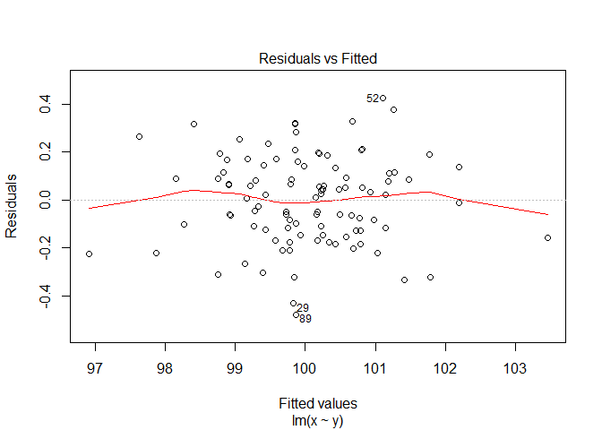
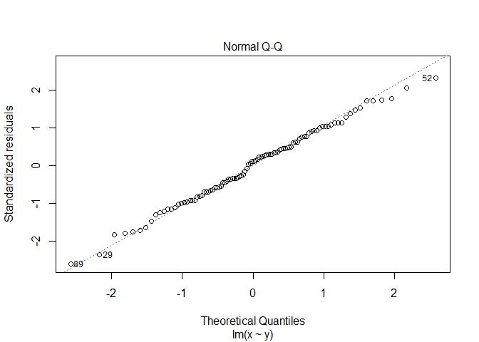
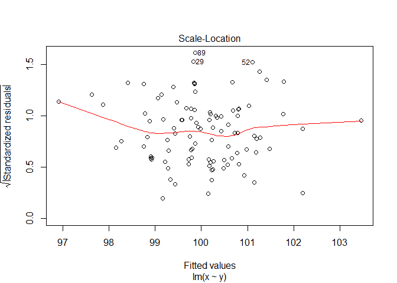
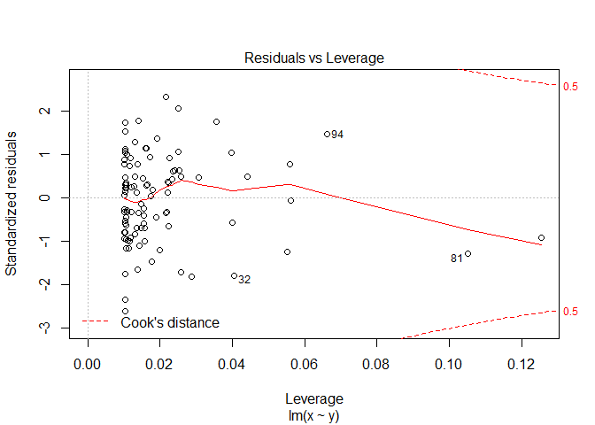

test.R
================
tharris
Tue Jan 15 17:01:47 2019

``` r
x <- rnorm(100, 100)

y <- x + (.2 * rnorm(100))

xy_mod <- lm(x ~ y)

summary(xy_mod)
```

    ## 
    ## Call:
    ## lm(formula = x ~ y)
    ## 
    ## Residuals:
    ##      Min       1Q   Median       3Q      Max 
    ## -0.47964 -0.12762  0.02192  0.13456  0.42528 
    ## 
    ## Coefficients:
    ##             Estimate Std. Error t value Pr(>|t|)    
    ## (Intercept)  4.92175    1.74000   2.829  0.00567 ** 
    ## y            0.95068    0.01739  54.660  < 2e-16 ***
    ## ---
    ## Signif. codes:  0 '***' 0.001 '**' 0.01 '*' 0.05 '.' 0.1 ' ' 1
    ## 
    ## Residual standard error: 0.185 on 98 degrees of freedom
    ## Multiple R-squared:  0.9682, Adjusted R-squared:  0.9679 
    ## F-statistic:  2988 on 1 and 98 DF,  p-value: < 2.2e-16

``` r
plot(xy_mod)
```


